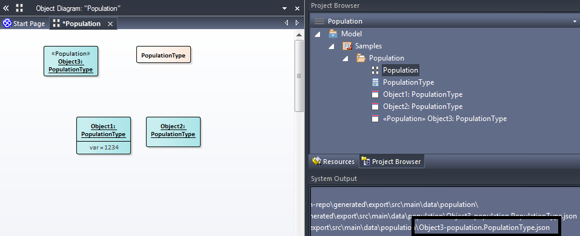
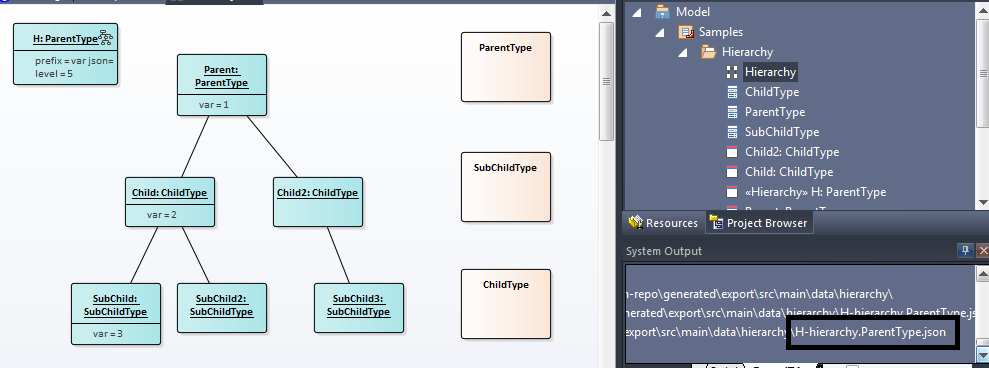
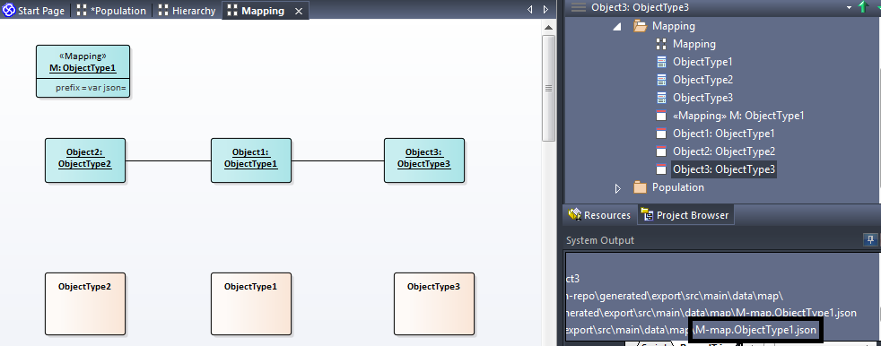
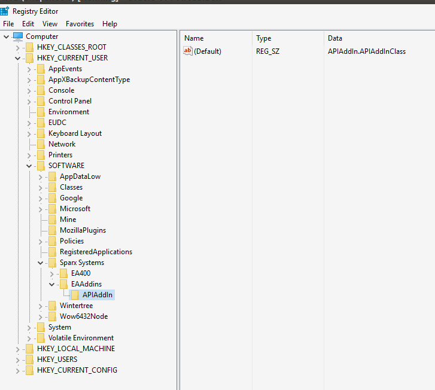

# RoundTrip AddIn

An Add In to Sparx Enterprise Architect to allows bidirectional synchronizing of various diagrams to the file system.

Currently there are 3 types of diagrams which can be exported/synchronized by this add in.
These are population , hierarchy and mapping diagrams.

## Population Diagram

This diagram contains a population of objects which are classified by some class type.

In the following diagram there are Object1 and Object2 which are classified as PopulationType. These are elements which will be exported/synced.
There is a PopulationType class but this does not need to be on the diagram.
There is another Object3 which is stereotyped as Population which marks it as the meta data for the diagram. Its name is used in the exported file name.
The diagram is also stereotyped as a 'PopulationDiagram' which the context which enables the Export Population and Sync Population menu options.


When this diagram is exported, the following file is generated.
Note that the object run state is exported along with the name and notes/description.
```json
[
  {
    "guid": "{CFF4ECBF-8D56-416d-AEB9-8F8666465B0D}",
    "name": "Object1",
    "notes": "",
    "type": "PopulationType",
    "var": "1234"
  },
  {
    "guid": "{E3499245-F4C1-4622-B276-B281C60C1531}",
    "name": "Object2",
    "notes": "",
    "type": "PopulationType"
  }
]
```

## Hierarchy Diagram

A Hierarchy Diagram works similarly but renders the relationships between parents and children via a 'parent' property in the generate json.

Note the meta data object 'H' in the sample below has run state which controls the 'min' property of the parent.  Children get a 'min' value 1 more than their parent.
The 'prefix' value is prefixed into the generated json for convenience to read into javascript.



```json
var json=[
  {
    "type": "ParentType",
    "id": "{75569D97-0C37-4530-AB84-90C5F77A6658}",
    "name": "Parent",
    "description": "",
    "min": 5,
    "parent": "null"
  },
  {
    "type": "ChildType",
    "id": "{B97ADADF-14FB-438c-88CA-DA4D76732823}",
    "name": "Child",
    "description": "",
    "min": 6,
    "parent": "{75569D97-0C37-4530-AB84-90C5F77A6658}"
  },
  {
    "type": "SubChildType",
    "id": "{A1E5FE68-D1C5-4f5a-AB41-8FEB58A4475C}",
    "name": "SubChild",
    "description": "",
    "min": 7,
    "parent": "{B97ADADF-14FB-438c-88CA-DA4D76732823}"
  },
  {
    "type": "SubChildType",
    "id": "{9809934B-078D-455a-835E-424BDD091986}",
    "name": "SubChild2",
    "description": "",
    "min": 7,
    "parent": "{B97ADADF-14FB-438c-88CA-DA4D76732823}"
  },
  {
    "type": "ChildType",
    "id": "{11BB57BD-2785-4d51-B3E0-0F99B1437B66}",
    "name": "Child2",
    "description": "",
    "min": 6,
    "parent": "{75569D97-0C37-4530-AB84-90C5F77A6658}"
  },
  {
    "type": "SubChildType",
    "id": "{9B0F8DDD-3634-4469-986D-E799A501BDDC}",
    "name": "SubChild3",
    "description": "",
    "min": 7,
    "parent": "{11BB57BD-2785-4d51-B3E0-0F99B1437B66}"
  }
]
```

You can edit this content and choose 'Sync Hierarchy' and the diagram will update.  (Currently doesnt work if a prefix is defined)

## Mapping Diagram

A Mapping Diagram works similarly but renders the relationships between elements to json.



Note the meta data object 'M' in the sample below.  The stereotype 'Mapping' identifies the object as the meta for the diagram.
The classification of 'ObjectType1' means that the mapping starts from all entities which are classified as 'ObjectType1' and exports all relationships on the diagram from those set of entities.

The output from the diagram about is below.
```json
var json=[
  {
    "source": "{605034F3-A61D-4f7c-A827-B19D11B8A859}",
    "sourcename": "Object1",
    "target": "{C8582FA6-1337-4d47-9F94-D8DBFD66CABD}",
    "targetname": "Object2",
    "value": 1
  },
  {
    "source": "{605034F3-A61D-4f7c-A827-B19D11B8A859}",
    "sourcename": "Object1",
    "target": "{5D057CC9-2B6B-4873-A827-E2E6380DC1E9}",
    "targetname": "Object3",
    "value": 1
  }
]

```


# Installation

- Build the solution in the RoundTripAddIn folder using visual studio community edition
- Using Regedit add the registry key to list Sparx EA to the class.

- Start EA.
- You should see the extension menus in Extensions-Round Trip.
  -   The extensions are context sensitive


# Thanks

  This project also reliese upon the [SVG Export](http://community.sparxsystems.com/community-resources/706-svg-diagram-export-add-in).
  Please install this plugin.


# Useful

If this is useful to you or you would be interested to some other features/capabilities. Let me know.
